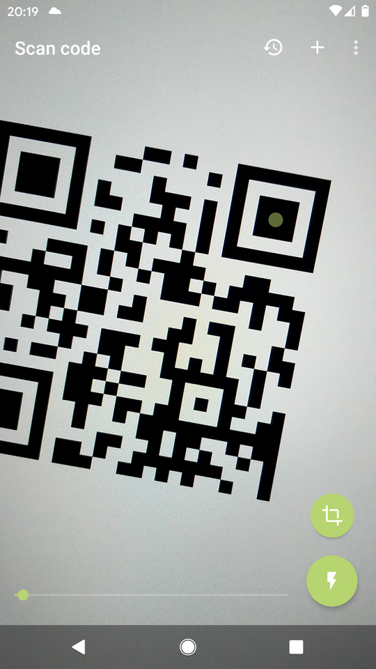
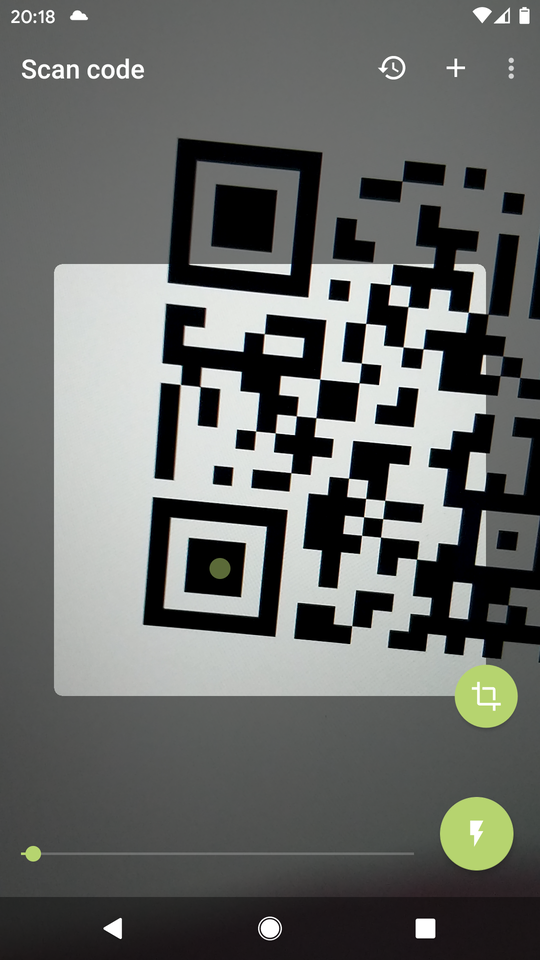
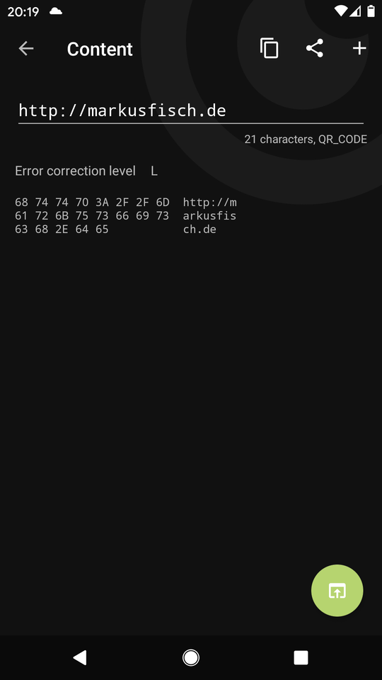
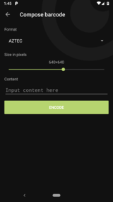

# Binary Eye

Yet another barcode scanner for Android. As if there weren't [enough][play].

This one is free, without any ads, and open source.

Works in portrait and landscape orientation, can read inverted codes,
comes in Material Design and can also generate barcodes.

Binary Eye uses the [ZXing-C++][zxing_cpp] ("Zebra Crossing") barcode
scanning library.

If you find this app useful and wish to support its continued development,
you can [buy me a coffee](https://www.buymeacoffee.com/markusfisch) or
send some Bitcoin decimals to `bc1q2guk2rpll587aymrfadkdtpq32448x5khk5j8z`.

<a href="https://www.buymeacoffee.com/markusfisch" target="_blank"></a>&nbsp;<a
	href="https://liberapay.com/markusfisch/" target="_blank"></a>&nbsp;<a
	href="https://ko-fi.com/markusfisch" target="_blank"></a>

## Screenshots






## Download

<a href="https://f-droid.org/en/packages/de.markusfisch.android.binaryeye/"></a> <a href="https://play.google.com/store/apps/details?id=de.markusfisch.android.binaryeye"></a>

## Supported Barcode Formats

### Read

ZXing can read the following barcode formats:
* [AZTEC][aztec]
* [CODABAR][codabar]
* [CODE 39][code_39]
* [CODE 93][code_93]
* [CODE 128][code_128]
* [DATA MATRIX][data_matrix]
* [DX FILM EDGE][dx_film_edge]
* [EAN 8][ean_8]
* [EAN 13][ean_13]
* [ITF][itf]
* [MAXICODE][maxicode] (partial)
* [PDF417][pdf417]
* [QR CODE][qr_code]
* [Micro QR Code][micro_qr_code]
* [rMQR Code][rmqr_code]
* [RSS 14][rss]
* [RSS EXPANDED][rss]
* [UPC A][upc_a]
* [UPC E][upc_e]
* [UPC EAN EXTENSION][upc_ean]

### Generate

ZXing can generate the following barcode formats:
* [AZTEC][aztec]
* [CODABAR][codabar]
* [CODE 39][code_39]
* [CODE 128][code_128]
* [DATA MATRIX][data_matrix]
* [EAN 8][ean_8]
* [EAN 13][ean_13]
* [ITF][itf]
* [PDF 417][pdf417]
* [QR CODE][qr_code]
* [UPC A][upc_a]

## Deep Links

You can invoke Binary Eye with a web URI intent from anything that can
open URIs.

### Decoding

1. [binaryeye://scan](binaryeye://scan) (note: GitHub does not render this as clickable link)
2. [http(s)://markusfisch.de/BinaryEye](http://markusfisch.de/BinaryEye)

If you want to get the scanned contents, you can add a `ret` query
argument with a (URL encoded) URI template. For example:

[http://markusfisch.de/BinaryEye?ret=http%3A%2F%2Fexample.com%2F%3Fresult%3D{RESULT}](http://markusfisch.de/BinaryEye?ret=http%3A%2F%2Fexample.com%2F%3Fresult%3D{RESULT})

Supported symbols are:

* `RESULT` - scanned content
* `RESULT_BYTES` - raw result as a hex string
* `FORMAT` - barcode format

### Encoding

1. [binaryeye://encode](binaryeye://encode)

You can use the URL arguments `content` and `format` to automatically
preset this data. For example:

1. [binaryeye://encode?content=Test&format=QR_CODE](binaryeye://encode?content=Test&format=QR_CODE)
2. [http(s)://markusfisch.de/encode?content=Test&format=QR_CODE](http://markusfisch.de/encode?content=Test&format=QR_CODE)
3. [http(s)://markusfisch.de/encode?content=Test&format=DATA_MATRIX](http://markusfisch.de/encode?content=Test2&format=DATA_MATRIX&execute)

If you want the code to be generated immediately, add `execute=true` (or just `execute`).

## Intents

You can also use Binary Eye from other apps by using an [Intent][intent].

If you prefer to integrate a barcode scanner into your app, take a look at [BarcodeScannerView][barcode_scanner_view] (if you also want to use
[ZXing-C++][zxing_cpp]) or read how to
[scan barcodes with ML Kit on Android][mlkit_barcode_scanning].

### SCAN Intent

Use the `com.google.zxing.client.android.SCAN` `Intent` with
[startActivityForResult()][start_activity] like this:

```kotlin
startActivityForResult(
	Intent("com.google.zxing.client.android.SCAN"),
	SOME_NUMBER
)
```

And process the result in [onActivityResult()][on_activity_result] of your
`Activity`:

```kotlin
override fun onActivityResult(
	requestCode: Int,
	resultCode: Int,
	data: Intent?
) {
	when (requestCode) {
		SOME_NUMBER -> if (resultCode == RESULT_OK) {
			val result = data.getStringExtra("SCAN_RESULT")
			…
		}
	}
}
```

If you're using AndroidX, this would be the new,
[recommended way][intent_result]:

```kotlin
class YourActivity : AppCompatActivity() {
	private val resultLauncher = registerForActivityResult(
		ActivityResultContracts.StartActivityForResult()
	) { result ->
		if (result.resultCode == RESULT_OK) {
			val content = result.data?.getStringExtra("SCAN_RESULT")
			…
		}
	}

	fun openScanner() {
		resultLauncher.launch(Intent("com.google.zxing.client.android.SCAN"))
	}
}
```

## Forwarding scans via Bluetooth

**Note:** The companion apps aren't developed nor maintained by the
author of Binary Eye.

In order to set up Bluetooth forwarding to a computer:

1. Pair your devices (phone and pc) if not paired already
2. Download and run a companion app:
	- Windows: https://github.com/KamaleiZestri/BinaryReceptorWindows
	- Linux: https://github.com/sean666888/bin_eye_bt_receiver
3. In the settings of Binary Eye, enable "Forward scans with Bluetooth"
	and select the appropriate target host device that is running the
	companion application.

[play]: https://play.google.com/store/search?q=barcode%20scanner&c=apps
[zxing_cpp]: https://github.com/zxing-cpp/zxing-cpp
[kotlin]: http://kotlinlang.org/
[aztec]: https://en.wikipedia.org/wiki/Aztec_Code
[codabar]: https://en.wikipedia.org/wiki/Codabar
[code_39]: https://en.wikipedia.org/wiki/Code_39
[code_93]: https://en.wikipedia.org/wiki/Code_93
[code_128]: https://en.wikipedia.org/wiki/Code_128
[data_matrix]: https://en.wikipedia.org/wiki/Data_Matrix
[dx_film_edge]: https://en.wikipedia.org/wiki/DX_encoding
[ean_8]: https://en.wikipedia.org/wiki/EAN-8
[ean_13]: https://en.wikipedia.org/wiki/International_Article_Number
[itf]: https://en.wikipedia.org/wiki/Interleaved_2_of_5
[maxicode]: https://en.wikipedia.org/wiki/MaxiCode
[pdf417]: https://en.wikipedia.org/wiki/PDF417
[qr_code]: https://en.wikipedia.org/wiki/QR_code
[micro_qr_code]: https://en.wikipedia.org/wiki/QR_code#Micro_QR_code
[rmqr_code]: https://www.qrcode.com/en/codes/rmqr.html
[rss]: https://en.wikipedia.org/wiki/GS1_DataBar
[upc_a]: https://en.wikipedia.org/wiki/Universal_Product_Code
[upc_e]: https://en.wikipedia.org/wiki/Universal_Product_Code#UPC-E
[upc_ean]: https://en.wikipedia.org/wiki/Universal_Product_Code#EAN-13
[intent]: https://developer.android.com/reference/android/content/Intent
[barcode_scanner_view]: https://github.com/markusfisch/BarcodeScannerView
[mlkit_barcode_scanning]: https://developers.google.com/ml-kit/vision/barcode-scanning/android
[start_activity]: https://developer.android.com/reference/android/app/Activity#startActivityForResult(android.content.Intent,%20int)
[on_activity_result]: https://developer.android.com/reference/android/app/Activity#onActivityResult(int,%20int,%20android.content.Intent)
[intent_result]: https://developer.android.com/training/basics/intents/result
