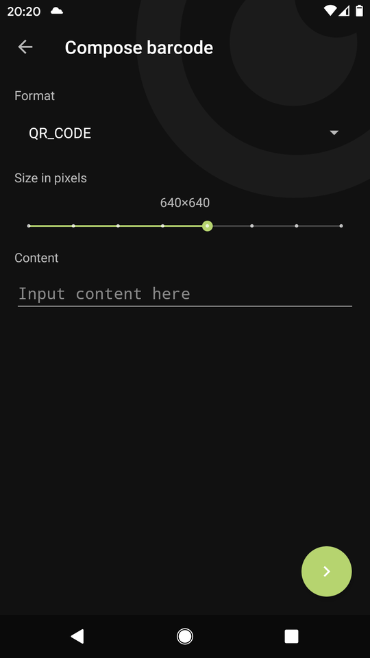

# Binary Eye

Yet another barcode scanner for Android. As if there weren't [enough][play].

This one is free, without any ads and open source.

Works in portrait and landscape orientation, can read inverted codes,
comes in Material Design and can also generate barcodes.

Binary Eye uses the [ZXing][zxing] ("Zebra Crossing") barcode scanning
library.

## Screenshots

## Download

 

## Supported Barcode Formats

### Read

ZXing can read the following barcode formats:
* [AZTEC][aztec]
* [CODABAR][codabar]
* [CODE 39][code_39]
* [CODE 93][code_93]
* [CODE 128][code_128]
* [DATA MATRIX][data_matrix]
* [EAN 8][ean_8]
* [EAN 13][ean_13]
* [ITF][itf]
* [MAXICODE][maxicode] (only when unrotated and unskewed, see [77][77],
	because of which Binary Eye *cannot* read this barcode)
* [PDF417][pdf417]
* [QR CODE][qr_code]
* [RSS 14][rss]
* [RSS EXPANDED][rss]
* [UPC A][upc_a]
* [UPC E][upc_e]
* [UPC EAN EXTENSION][upc_ean]

### Generate

ZXing can generate the following barcode formats:
* [AZTEC][aztec]
* [CODABAR][codabar]
* [CODE 39][code_39]
* [CODE 128][code_128]
* [DATA MATRIX][data_matrix]
* [EAN 8][ean_8]
* [EAN 13][ean_13]
* [ITF][itf]
* [PDF 417][pdf417]
* [QR CODE][qr_code]
* [UPC A][upc_a]

[play]: https://play.google.com/store/search?q=barcode%20scanner&c=apps
[zxing]: https://github.com/zxing/zxing
[kotlin]: http://kotlinlang.org/
[aztec]: https://en.wikipedia.org/wiki/Aztec_Code
[codabar]: https://en.wikipedia.org/wiki/Codabar
[code_39]: https://en.wikipedia.org/wiki/Code_39
[code_93]: https://en.wikipedia.org/wiki/Code_93
[code_128]: https://en.wikipedia.org/wiki/Code_128
[data_matrix]: https://en.wikipedia.org/wiki/Data_Matrix
[ean_8]: https://en.wikipedia.org/wiki/EAN-8
[ean_13]: https://en.wikipedia.org/wiki/International_Article_Number
[itf]: https://en.wikipedia.org/wiki/Interleaved_2_of_5
[maxicode]: https://en.wikipedia.org/wiki/MaxiCode
[pdf417]: https://en.wikipedia.org/wiki/PDF417
[qr_code]: https://en.wikipedia.org/wiki/QR_code
[rss]: https://en.wikipedia.org/wiki/GS1_DataBar
[upc_a]: https://en.wikipedia.org/wiki/Universal_Product_Code
[upc_e]: https://en.wikipedia.org/wiki/Universal_Product_Code#UPC-E
[upc_ean]: https://en.wikipedia.org/wiki/Universal_Product_Code#EAN-13
[77]: https://github.com/markusfisch/BinaryEye/issues/77
